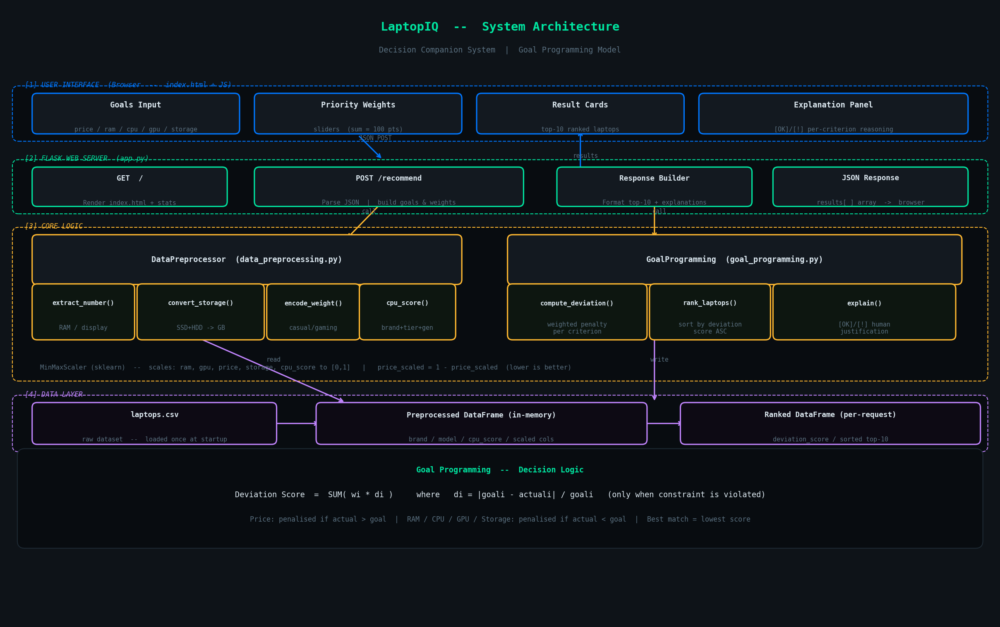

# LaptopIQ — Decision Companion System

> A web application that helps users find the best laptop by evaluating options against their personal goals using a **Goal Programming** model.



---

## Understanding the Problem

Most laptop recommendation tools either filter by hard cutoffs ("show me laptops under ₹80,000") or rank by a single metric. The real problem is that users have **multiple, competing goals** — they want a low price *and* high RAM *and* a fast CPU — and not all goals matter equally.

This system treats the problem as it actually is: a **multi-criteria decision problem**. Instead of hard filters, it measures how far each laptop deviates from the user's ideal, weights those deviations by importance, and ranks laptops by their total weighted deviation. The laptop with the lowest deviation score is the closest match to what the user actually wants.

---

## How It Works

### The Core Idea — Goal Programming

Goal Programming is a classical Operations Research technique for multi-objective optimisation. For each laptop, the system computes a **deviation score**:

```
Deviation Score = SUM( weight_i * deviation_i )

where:
  deviation_i = |goal_i - actual_i| / goal_i   (only when the constraint is violated)
```

Constraint direction matters:
- **Price** — penalised only if `actual > goal` (over budget is bad; under budget is fine)
- **RAM, CPU, GPU, Storage** — penalised only if `actual < goal` (falling short is bad; exceeding is fine)

The laptop with the **lowest score** is the best match. A score of `0.0` means the laptop perfectly meets or exceeds every goal.

### Why Not Use an AI Model for Ranking?

The ranking logic is entirely deterministic and explainable. Given the same inputs, it always produces the same output, and every score can be traced back to a formula. AI models are used in the explanation text generation, but the actual decision — which laptop ranks where — is made by the mathematical model, not by a language model.

---

## Assumptions Made

- **CPU Score is engineered, not raw data.** The dataset does not include benchmark scores, so a composite `cpu_score` is computed from processor brand, tier (i3/i5/i7/Ryzen 5/M2, etc.), and generation. The maximum possible score is ~20.5 (AMD Ryzen 9 7000-series).
- **Storage types are additive.** A laptop with 512 GB SSD + 1 TB HDD has 1536 GB total storage. The system evaluates total storage against the goal, but the card display shows the breakdown (e.g. "512 GB SSD + 1024 GB HDD").
- **Weights are relative, not absolute.** The slider values (0–100) are normalised to proportions before use, so only the ratios between them matter, not the raw totals.
- **All prices are in Indian Rupees (₹).**
- **The dataset is static.** Laptops are loaded once at startup. Refreshing does not re-fetch data.

---

## Architecture

```
Browser (index.html)
    │  POST /recommend  {goals, weights}
    ▼
Flask App (app.py)
    │  normalise weights → call DataPreprocessor → call GoalProgramming
    ▼
DataPreprocessor (data_preprocessing.py)
    │  cleans raw CSV: extracts numbers, converts storage, engineers cpu_score
    │  scales all numeric features to [0,1] with MinMaxScaler
    ▼
GoalProgramming (goal_programming.py)
    │  compute_deviation() per laptop
    │  rank_laptops() → sort ascending by deviation score
    │  explain() → human-readable justification per criterion
    ▼
JSON Response → Result Cards + Explanation Panel
```

The full layered diagram is in `architecture.png`.

### Key Files

| File | Role |
|---|---|
| `app.py` | Flask server, routes, response formatting |
| `data_preprocessing.py` | Data cleaning, feature engineering, scaling |
| `goal_programming.py` | Deviation scoring, ranking, explanation generation |
| `templates/index.html` | Single-page UI — form, sliders, result cards |
| `data/laptops.csv` | Source dataset |

---

## Design Decisions and Trade-offs

### Goal Programming over Machine Learning
A trained model would be a black box — the user cannot inspect why laptop A was ranked above laptop B. Goal Programming produces a score that is directly traceable to the input goals and weights, which satisfies the "explainable" requirement.

**Trade-off:** The cpu_score heuristic is hand-crafted and may not perfectly reflect real-world performance. A benchmark database integration (e.g. Cinebench scores) would improve accuracy.

### CPU Score as a Heuristic
The dataset has processor brand, name, and generation but no numeric performance score. A composite score is computed by assigning points for brand tier (i3=3, i7=7, Ryzen 9=9, Apple M3=9) and generation (Intel: gen × 0.5, AMD: series ÷ 1000 × 1.5). This is transparent and adjustable.

**Trade-off:** The generation multiplier for AMD scales with the series number, meaning a Ryzen 9 9000 series scores higher than a 7000 series, which is directionally correct but not calibrated to actual performance gaps.

### MinMaxScaler Applied Per Column at Startup
Features are scaled once when the server starts, not per-request. This means scales are consistent across requests and scaling is not recomputed repeatedly.

**Trade-off:** If the dataset were updated at runtime, the scaler would need to be re-fit. For a static dataset this is not an issue.

### Single-page UI, No Framework
The frontend is plain HTML + vanilla JS in a single template file. No React, no build step, no node_modules. This keeps the project runnable with just `pip install` and `python app.py`.

**Trade-off:** As the UI grows, a component-based framework would improve maintainability.

---

## Edge Cases Considered

- **Zero weights** — if all sliders are at 0, the total is 1 (guarded in `app.py`) to avoid division by zero. All laptops get score 0 and are returned in dataset order.
- **Goal of 0** — if a user sets a goal of 0 for any criterion, division by zero in the deviation formula is avoided because the `if actual < goal` condition is never true for non-negative values.
- **Missing / NaN data** — `extract_number()` and `convert_storage_to_gb()` return `0` for null or unparseable values, so no row is dropped.
- **Input validation** — the frontend enforces min/max bounds on all inputs and shows an error message before submitting if any value is out of range.
- **All laptops exceed budget** — the system still returns the top 10; they will all have a non-zero price deviation. The deviation score tells the user by how much.

---

## How to Run

### Prerequisites

- Python 3.9+
- pip

### Installation

```bash
# Clone or download the project
cd laptopiq

# Install dependencies
pip install flask pandas scikit-learn

# Place your dataset
# Ensure data/laptops.csv exists with the required columns
```

### Required CSV Columns

```
brand, model, processor_brand, processor_name, processor_gnrtn,
ram_gb, ssd, hdd, graphic_card_gb, weight,
display_size, warranty, star_rating, latest_price
```

### Start the Server

```bash
python app.py
```

Open your browser at `http://127.0.0.1:5000`

### Using the App

1. **Set your goals** — enter your maximum acceptable price and minimum acceptable values for RAM, CPU score, GPU, and storage.
2. **Set priority weights** — drag the sliders to reflect how much each criterion matters to you. The total can be any value; it is normalised automatically.
3. **Click "Find Best Matches"** — the top 10 laptops closest to your goals are displayed, sorted by deviation score.
4. **Read the explanation** — each card shows a per-criterion breakdown of whether the laptop met or missed each goal.

---

## What I Would Improve With More Time

- **Real CPU benchmarks** — integrate Cinebench or Passmark scores from an API instead of the hand-crafted heuristic.
- **Brand/model filter** — let users exclude or prefer specific brands.
- **Comparison mode** — allow users to pin two laptops side-by-side.
- **Persistent preferences** — save user goals and weights in localStorage so they are remembered across sessions.
- **Dataset refresh** — add an admin endpoint to reload the CSV without restarting the server.
- **Unit tests** — add pytest coverage for `compute_cpu_score`, `compute_deviation`, and `explain` edge cases.
- **Mobile layout** — the form grid and result cards need responsive breakpoints for small screens.

---

## Dependencies

| Package | Purpose |
|---|---|
| `flask` | Web server and routing |
| `pandas` | Data loading and manipulation |
| `scikit-learn` | MinMaxScaler for feature normalisation |
